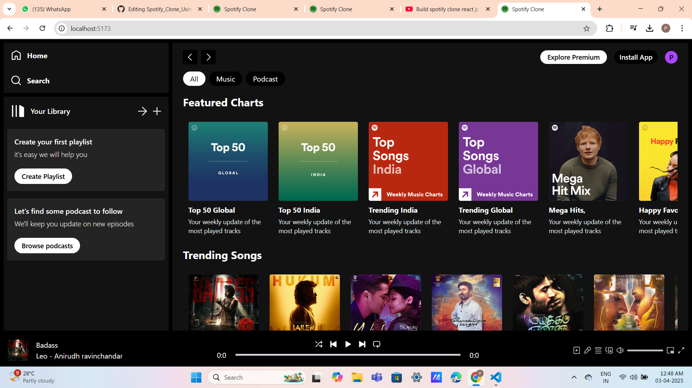
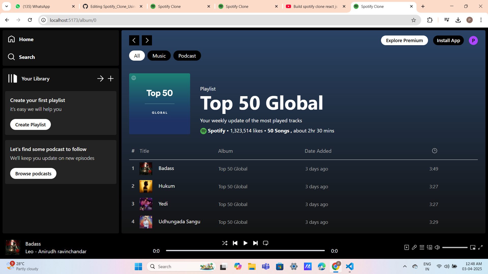

## Spotify 2.0 Clone 🎶
A powerful and sleek Spotify 2.0 Clone built with React.js, offering an immersive and enhanced music streaming experience. Browse songs, explore genres, manage playlists, and enjoy smooth audio playback with modern UI and seamless navigation.

## 🚀 Features
🎧 Player Controls: Play, pause, skip, seek, and volume control for a seamless listening experience.

🔍 Search Functionality: Easily find tracks, albums, artists, and playlists.

🎼 Music Playlists: Create, view, and manage custom playlists.

🗂️ Albums & Genres: Browse music by albums and filter by genre for better discovery.

🧭 Smooth Navigation: Multi-page routing using React Router.

🧠 State Management: Built using React Context API for efficient global state handling.

🎨 Modern UI: Styled with Tailwind CSS or Styled Components for a responsive and clean design.

## 🛠️ Technologies Used
React.js ⚛️

React Router 🛤️

Context API 🏗️

Styled Components / Tailwind CSS 🎨

Spotify Web API (or custom API) 🔗

HTML5 Audio API 🔊

## 📸 Screenshots

## Homepage 


## Display page



## 📁 Project Setup
```bash

git clone https://github.com/Pankajkumar12345678/spotify_clone.git

cd spotify-2.0-clone

npm install

npm start

```


